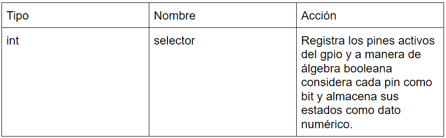
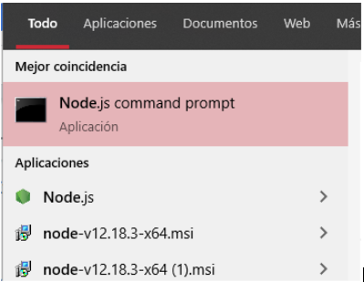
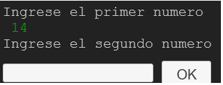
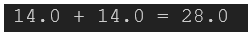

# Producto-de-Unidad-2-Chanchay-Lema-Zurita

## 1.Planteamiento del Problema
Identificar, Investigar y llevar a la práctica una interfaz gráfica en Node-Red y una Calculadora Científica con POO(Programacion orientada a objetos) esto en una Raspberry Pi

## 2.Objetivos
- **General**
     - Diseñar programas funcionales para las plataformas o dispositivos Node-Red y Raspberry pi.
- **Específicos**
     - Aplicar conceptos de programación orientada a objetos mediante la creación de un programa funcional en python que sea corrido en una Raspberry pi.
     - Implementar una calculadora científica en una raspberry pi agregando controles mediante el puerto GPIO y programación orientada a objetos.
     - Crear una interfaz humano máquina mediante Node-Red.
     
## 3.Estado del Arte


En lo que respecta a nuestro Producto de Unidad cada una de estas investigaciones tienen su aportación pero estas deberán ser analizadas desde 2 perspectivas distintas.
 - Respecto al ámbito educativo Raspberry es un dispositivo con el cual podemos aprender acerca de distintas materias dentro de la computación como lo seria programacion o robotica a un bajo costo.
 - Herramientas como Raspberry o Node-Red no solamente nos son útiles para aprender, sino nos pueden ayudar  a solucionar problemas reales como lo son el control de tráfico de una ciudad y no solo solucionarlos, sino darles un valor agregado como lo es agregar IoT con Raspberry o plataformas de recopilación de datos visuales mediante Node-Red.
 
## 4.Marco Teórico
### Node-Red
#### ¿Qué es una interfaz HMI?
HMI son las siglas de human-machine interface y se refieren a un panel que permite a un usuario comunicarse con una máquina, software o sistema. Técnicamente, se puede referir a cualquier pantalla que se use para interactuar con un equipo, pero se utiliza normalmente para las de entornos industriales. Las HMI muestran datos en tiempo real y permiten al usuario controlar las máquinas con una interfaz gráfica de usuario.
#### Función  principal
La función principal de los HMI es mostrar información en tiempo real, proporcionar gráficos visuales y digeribles que aporten significado y contexto sobre el estado del motor, la válvula, niveles y demás parámetros de un determinado proceso.
Es decir, suministran información operativa al proceso y permiten controlar y optimizar los objetivos de productos y del proceso en sí. Si tuviéramos que mencionar palabras clave que definan el sistema HMI es: operar y observar.
#### ¿Cómo diseñar una interfaz HMI en Node RED?
Para poder diseñar una interfaz hombre máquina que sea atractiva visualmente y que cumpla con su proceso de interacción correcto, podemos utilizar un dashboard en la herramienta de programación de Node-RED, la cual nos permitirá ir creando una interfaz por medio de Widgets manipulables a antojo del programador para que finalmente llegue a ser intuitivo para el usuario que vaya hacer uso de esta interfaz.
#### ¿Que es Node-RED dashboard?
Este módulo proporciona un conjunto de nodos en Node-RED para crear rápidamente un panel de datos en vivo.
Estos nodos requieren node.js versión 8. La última versión para admitir el nodo v6 fue 2.9.5.
Desde la versión 2.10.0, puede crear e instalar nodos de widget como otros nodos Node-RED.


### Raspberry Pi
#### ¿Qué es Raspberry y para qué sirve? 
Raspberry Pi, es un «es un ordenador de tamaño de tarjeta de crédito que se conecta a su televisor y un teclado». Es una placa que soporta varios componentes necesarios en un ordenador común.«Es un pequeño ordenador capaz, que puede ser utilizado por muchas de las cosas que su PC de escritorio hace, como hojas de cálculo, procesadores de texto y juegos. También reproduce vídeo de alta definición», apuntan en la página web del producto.
Este proyecto fue ideado en 2006 pero no fue lanzado al mercado en febrero de 2012. Ha sido desarrollado por un grupo de la Universidad de Cambridge y su misión es fomentar la enseñanza de las ciencias de la computación a los niños. De hecho, en enero de este año Google donó más de 15.000 Raspberry Pi para colegios en Reino Unido.
Es un ordenador muy funcional y debido a su tamaño puede funcionar para muchos otros propósitos, claro, hay que tener algunas ideas sobre programación o de computación. Por ejemplo, el primer proyecto de un joven con Raspberry Pi fue convertir su consola NES dañada en una operativa y pudo jugar algunos viejos títulos.
**Componentes del Raspberry Pi 4**
-Características de la Raspberry Pi 4 Broadcom BCM2711, Cortex núcleo cuádruple-A72 (ARM v8) 64-bit SoC @ 1.5GHz 
- SDRAM LPDDR4-2400 de 1 GB, 2 GB, 4 GB y 8 GB (según el modelo) 
- 2,4 GHz y 5,0 GHz IEEE 802.11ac inalámbrico, Bluetooth 5.0, BLE 
- Gigabit Ethernet 2 puertos USB 3.0; 2 puertos USB 2.0. 
- Cabezal GPIO estándar de 40 pines de Raspberry Pi (totalmente compatible con las placas anteriores) 
- 2 × puertos micro-HDMI (soportados hasta 4kp60) 
- Puerto de pantalla MIPI DSI de 2 vías 
- Puerto de cámara MIPI CSI de 2 carriles 
- Puerto de audio estéreo de 4 polos y de vídeo compuesto H.265 (decodificación 4kp60) 
- H264 (decodificación 1080p60, decodificación 1080p30) 
- Gráficos OpenGL ES 3.0 
- Ranura para tarjetas Micro-SD para cargar el sistema operativo y el almacenamiento de datos 
- 5V DC a través de conector USB-C (mínimo 3A*) 
- 5V DC vía cabezal GPIO (mínimo 3A*)
- Alimentación a través de Ethernet (PoE) habilitada (requiere PoE HAT separado) 
- Temperatura de funcionamiento: 0 – 50 grados C ambiente
#### ¿Que es GPIO?
General Purpose Input Output (GPIO) es un sistema de entrada y salida de propósito general, es decir, consta de una serie de pines o conexiones que se pueden usar como entradas o salidas para múltiples usos. Estos pines están incluidos en todos los modelos de Raspberry Pi aunque con diferencias.


- Amarillo (2): Alimentación a 3.3V.
- Rojo (2): Alimentación a 5V.
- Naranja (26): Entradas / salidas de proposito general. Pueden configurarse como entradas o salidas. Ten presente que el nivel --alto es de 3.3V y no son tolerantes a tensiones de 5V.
- Gris (2): Reservados.
- Negro (8): Conexión a GND o masa.
- Azul (2): Comunicación mediante el protocolo I2C para comunicarse con periféricos que siguen este protocolo.
- Verde (2): Destinados a conexión para UART para puerto serie convencional.
- Morado (5): Comunicación mediante el protocolo SPI para comunicarse con periféricos que siguen este protocolo.

#### Programación orientada a objetos (POO)
La programación orientada a objetos es un paradigma de programación en que los programas son vistos como formados por entidades llamadas objetos que recuerdan su propio estado y que se comunican entre sí mediante el paso de mensajes que se intercambian con la finalidad de:cambiar sus estados internos,compartir información ,solicitar a otros objetos el procesamiento de dicha información (Lopez,2020)
Algunos conceptos basicos de POO son: 
- Clase
Definiciones de las propiedades y comportamiento de un tipo de objeto concreto. La instanciación es la lectura de estas definiciones y la creación de un objeto a partir de ellas.
- Objeto
Instancia de una clase. Entidad provista de un conjunto de propiedades o atributos (datos) y de comportamiento o funcionalidad (métodos), los mismos que consecuentemente reaccionan a eventos. Se corresponden con los objetos reales del mundo que nos rodea, o con objetos internos del sistema (del programa). Es una instancia a una clase.
- Método
Algoritmo asociado a un objeto (o a una clase de objetos), cuya ejecución se desencadena tras la recepción de un “mensaje”. Desde el punto de vista del comportamiento, es lo que el objeto puede hacer. Un método puede producir un cambio en las propiedades del objeto, o la generación de un “evento” con un nuevo mensaje para otro objeto del sistema.
- Mensaje
Una comunicación dirigida a un objeto, que le ordena que ejecute uno de sus métodos con ciertos parámetros asociados al evento que lo generó
- Comportamiento
Está definido por los métodos o mensajes a los que sabe responder dicho objeto, es decir, qué operaciones se pueden realizar con él.
- Evento
Es un suceso en el sistema (tal como una interacción del usuario con la máquina, o un mensaje enviado por un objeto). El sistema maneja el evento enviando el mensaje adecuado al objeto pertinente. También se puede definir como evento la reacción que puede desencadenar un objeto; es decir, la acción que genera.
- Atributos
Características que tiene la clase
- Propiedad o atributo
Contenedor de un tipo de datos asociados a un objeto (o a una clase de objetos), que hace los datos visibles desde fuera del objeto y esto se define como sus características predeterminadas, y cuyo valor puede ser alterado por la ejecución de algún método.
- Estado interno
Es una variable que se declara privada, que puede ser únicamente accedida y alterada por un método del objeto, y que se utiliza para indicar distintas situaciones posibles para el objeto (o clase de objetos). No es visible al programador que maneja una instancia de la clase.
- Componentes de un objeto
Atributos, identidad, relaciones y métodos.
- Identificación de un objeto
Un objeto se representa por medio de una tabla o entidad que esté compuesta por sus atributos y funciones correspondientes.
#### POO en python
En python la POO se expresa de manera simple y fácil de escribir pero debes tener en cuenta que para programar debes entender cómo funciona la teoría de POO y aplicarla al código.
La teoría de la POO nos dice que todos los objetos deben pertenecer a una clase, ya que esta es la base para diferenciarse unos de otros teniendo atributos y comportamientos que los distingan de otros objetos que pertenezcan a otras clases, para crear clases en python lo hacemos de la siguiente manera:
class Auto():
Para definir un atributo simplemente creamos una variable con total normalidad y un valor cualquiera por dar:
class Auto():
    ruedas=4
Para definir un método lo hacemos igual como lo hacemos con una función con la palabra por defecto def y el nombre de dicho método pero para diferenciar un método de una función lo hacemos escribiendo dentro de sus paréntesis el parámetro self:
def desplazamiento(self):
    pass
La palabra self hace referencia a los objetos que pertenezcan a la clase y la palabra pass que colocamos dentro del método le indica a el intérprete de python que todavía no le hemos definido ningún funcionamiento a ese método.
Cuando tenemos nuestra clase lista ya podemos empezar a crear objetos que pertenezcan a esa clase, para crear objetos lo hacemos de la siguiente manera:

miVehiculo=Auto()

Para mostrar atributos:

miObjeto.atributo

Para mostrar métodos:

miObjeto.metodo()
  
Constructor __init__()
El método __init__() es un método especial, el cual se ejecuta al momento de instanciar un objeto. El comportamiento de __init__() es muy similar a los “constructores” en otros lenguajes. Los argumentos que se utilizan en la definición de __init__() corresponden a los parámetros que se deben ingresar al instanciar un objeto.

   def __init__(self, cedula, nombre, apellido, sexo):
   
Constructor de clase Persona
        
self.cedula = cedula
        
self.nombre = nombre
       
self.apellido = apellido
       
self.sexo = sexo

#### Compilador create.with.code.uk
Este compilador nace como un proyecto en el Reino Unido destinado a la enseñanza de programación en python para los niños ofreciendo una gran cantidad de herramientas, librerías y tutoriales sin la necesidad de tener que descargar nada en nuestra computadora.
Dentro de las herramientas que nos ofrece este compilador contamos con la de en emulador de puertos GPIO del raspberry pi usando únicamente la librería de python propia del uso de una GPIO RPi.GPIO.


## 5.Diagramas
### Node-Red
En el siguiente diagrama se evidencia los nodos utilizados con sus respectivas conexiones para poder realizar la interfaz HMI


### Diagramas por grupos
#### Grupo instrucciones
Boton que al presionarlo nos devolvera como salida un mensaje acompañado con una salida de audio, en este caso el botón nos desplegara unas instrucciones.


Switch que nos permitirá cambiar entre dos estados (activo e inactivo) al cual se la ha añadido una salida de audio y se le adiciono el mostrar una notificación del estado en el que se encuentra


#### Grupo Género
El dropdown nos permite elegir entre diferentes opciones, en este caso se la indicado que muestre opciones de género.
También podemos observar una entrada de texto con el fin de que responda a la pregunta planteada en la etiqueta 
Por último podemos ver un slider, conectado a un char y un gauge que nos arrojan un resultado de manera gráfica y estadística acorde a cuanto deslicemos el slider.


#### Grupo frecuencia de actividad sexual
Este grupo está representado mediante sliders que representan un periodo de tiempo en meses, los cuales serán representados gráficamente mediante el chart, el cual nos presenta varios métodos de graficación, en este caso hemos usado el modo de línea.


#### Grupo Color Favorito


### Calculadora científica programada con python para RaspberryPi
El siguiente diagrama muestra el esquema de conexión de una calculadora científica en Raspberry pi, esta esta calculadora contará con distintos los siguientes cálculos: 
Operaciones Básicas

**1.Funciones trigonométricas**

**2.Raíces,Potencias y Logaritmos**

**3.Valores Absolutos**

**4.Factorial**

**5.Operaciones Basicas**

**6.Funciones hiperbólicas**

La calculadora solamente podrá efectuar una operación a la vez y para el caso de las operaciones básicas únicamente puede operar 2 números a la vez. La calculadora contará con la opción de seleccionar que tipo de operación quiera realizar el usuario según el interruptor activo que el menú del programa le indique al usuario.
El esquema para los interruptores es el siguiente:


El circuito contará con 6 interruptores selectores conectados a los pines GPIO: 3,5,7,11,13,15. Cabe aclarar que para seleccionar la operación de la calculadora solo se debe seleccionar una operación e indicarla en el interruptor correspondiente a esa función, si el usuario escoge más de 2 operaciones el programa le indicará un error.
Para el ingreso de números será necesario un teclado.

## 6.Lista de Componentes
### Node-RED
 - Instalar Node.js (version 10.0 en adelante)
 - Incorporar el palette “Node-RED dashboard”
### Calculadora científica programada con python para RaspberryPi
- 6 resistencias de 4.7k
- 6 interruptores
- 1 Raspberry pi
- 1 Teclado
## 7.Mapa de Variables
### Calculadora científica programada con python para RaspberryPi
Programa General


Para cada función describiremos de forma general las variables según el tipos de cálculo a realizar:
Menús


Cálculos Básicos


Funciones Trigonometricas


Raíces


Potencia


Logaritmos


Factorial


Valor Absoluto


Funciones Hiperbolicas


Funciones para GPIO.

Iniciar gpio.

No necesita variables.

Selector de pin.



## 8.Explicacion de codigo fuente
### Node-Red
```
//Se explicara el primer nodo ya que la misma configuracion se uso para los demas 
[
    {
        "id": "4b47f5ce.da535c",
        "type": "ui_button",  // se incluye el boton como inicio de la interfaz 
        "z": "3f8d5747.64fe38",
        "name": "",
        "group": "d45940ce.b9cb7",
        "order": 0,  // el orden, espacio, y demas no se modifican
        "width": 0,
        "height": 0,
        "passthru": false,
        "label": "Instrucciones ",  // se le da el nombre de instrucciones en la etiqueta
        "tooltip": "",
        "color": "",
        "bgcolor": "",
        "icon": "",
        "payload": "Llene los diferentes campos presentados a continuacion a manera de recopilar sus datos",  // nos regresara este mensaje al presionar el boton
        "payloadType": "str",
        "topic": "",
        "x": 150,
        "y": 40,
        "wires": [
            [
                "8f8a3c22.1752b",
                "5669a918.959f18",
                "a6d74d5d.6c7d6"
            ]
        ]
    },
    {
        "id": "d45940ce.b9cb7",
        "type": "ui_group",
        "z": "",
        "name": "pulse para leer las intrucciones", //el nombre se lo usa como instruccion 
        "tab": "1bf19278.efedfe",
        "order": 1,
        "disp": true,
        "width": "6",
        "collapse": false
    },
    {
        "id": "1bf19278.efedfe",
        "type": "ui_tab",
        "z": "",
        "name": "Salud",
        "icon": "dashboard",
        "order": 2,
[
    {
        "id": "3f8d5747.64fe38",
        "type": "tab",
        "label": "Flow 1",
        "disabled": false,
        "info": ""
    },
    {
        "id": "4b47f5ce.da535c",
        "type": "ui_button",
        "z": "3f8d5747.64fe38",
        "name": "",
        "group": "d45940ce.b9cb7",
        "order": 0,
        "width": 0,
        "height": 0,
        "passthru": false,
        "label": "Instrucciones ",
        "tooltip": "",
        "color": "",
        "bgcolor": "",
        "icon": "",
        "payload": "Llene los diferentes campos presentados a continuacion a manera de recopilar sus datos",
        "payloadType": "str",
        "topic": "",
        "x": 150,
        "y": 40,
        "wires": [
            [
                "8f8a3c22.1752b",
                "5669a918.959f18",
                "a6d74d5d.6c7d6"
            ]
        ]
    },
    {
        "id": "8f8a3c22.1752b",
        "type": "debug",
        "z": "3f8d5747.64fe38",
        "name": "",
        "active": true,
        "tosidebar": true,
        "console": false,
        "tostatus": false,
        "complete": "payload",
        "targetType": "msg",
        "statusVal": "",
        "statusType": "auto",
        "x": 400,
        "y": 120,
        "wires": []
    },
    {
        "id": "5669a918.959f18",
        "type": "ui_text",
        "z": "3f8d5747.64fe38",
        "group": "d45940ce.b9cb7",
        "order": 1,
        "width": 0,
        "height": 0,
        "name": "",
        "label": "",
        "format": "{{msg.payload}}",
        "layout": "row-spread",
        "x": 430,
        "y": 40,
        "wires": []
    },
    {
        "id": "4e1a8413.6d2f5c",
        "type": "ui_dropdown",
        "z": "3f8d5747.64fe38",
        "name": "",
        "label": "",
        "tooltip": "",
        "place": "seleccione su genero",
        "group": "82511ffa.007e1",
        "order": 1,
        "width": 0,
        "height": 0,
        "passthru": true,
        "multiple": false,
        "options": [
            {
                "label": "Masculino",
                "value": "1",
                "type": "str"
            },
            {
                "label": "Femenino",
                "value": "2",
                "type": "str"
            },
            {
                "label": "Gay ",
                "value": "3",
                "type": "str"
            },
            {
                "label": "Lesbiana ",
                "value": "4",
                "type": "str"
            },
            {
                "label": "Bisexual",
                "value": "5",
                "type": "str"
            }
        ],
        "payload": "",
        "topic": "",
        "x": 140,
        "y": 620,
        "wires": [
            []
        ]
    },
    {
        "id": "e2d4cfa7.1a02b",
        "type": "ui_slider",
        "z": "3f8d5747.64fe38",
        "name": "",
        "label": "Marzo-Abril",
        "tooltip": "",
        "group": "f57592e5.7ffea",
        "order": 3,
        "width": 0,
        "height": 0,
        "passthru": true,
        "outs": "end",
        "topic": "",
        "min": 0,
        "max": 10,
        "step": 1,
        "x": 140,
        "y": 360,
        "wires": [
            [
                "49f1c76.a193138"
            ]
        ]
    },
    {
        "id": "49f1c76.a193138",
        "type": "ui_chart",
        "z": "3f8d5747.64fe38",
        "name": "",
        "group": "f57592e5.7ffea",
        "order": 8,
        "width": "6",
        "height": "5",
        "label": "chart",
        "chartType": "line",
        "legend": "false",
        "xformat": "D/M",
        "interpolate": "linear",
        "nodata": "",
        "dot": false,
        "ymin": "1",
        "ymax": "10",
        "removeOlder": 1,
        "removeOlderPoints": "12",
        "removeOlderUnit": "604800",
        "cutout": 0,
        "useOneColor": false,
        "useUTC": false,
        "colors": [
            "#1f77b4",
            "#aec7e8",
            "#ff7f0e",
            "#2ca02c",
            "#98df8a",
            "#d62728",
            "#ff9896",
            "#9467bd",
            "#c5b0d5"
        ],
        "useOldStyle": false,
        "outputs": 1,
        "x": 440,
        "y": 440,
        "wires": [
            []
        ]
    },
    {
        "id": "5b9dec06.1809e4",
        "type": "ui_slider",
        "z": "3f8d5747.64fe38",
        "name": "",
        "label": "Septiembre-Octubre",
        "tooltip": "",
        "group": "f57592e5.7ffea",
        "order": 6,
        "width": 0,
        "height": 0,
        "passthru": true,
        "outs": "end",
        "topic": "",
        "min": 0,
        "max": 10,
        "step": 1,
        "x": 190,
        "y": 500,
        "wires": [
            [
                "49f1c76.a193138"
            ]
        ]
    },
    {
        "id": "234addce.c1a8a2",
        "type": "ui_slider",
        "z": "3f8d5747.64fe38",
        "name": "",
        "label": "Enero-Febrero",
        "tooltip": "",
        "group": "f57592e5.7ffea",
        "order": 2,
        "width": 0,
        "height": 0,
        "passthru": true,
        "outs": "end",
        "topic": "",
        "min": 0,
        "max": 10,
        "step": 1,
        "x": 150,
        "y": 320,
        "wires": [
            [
                "49f1c76.a193138"
            ]
        ]
    },
    {
        "id": "1eb796cd.a27f29",
        "type": "ui_slider",
        "z": "3f8d5747.64fe38",
        "name": "",
        "label": "Mayo-Junio",
        "tooltip": "",
        "group": "f57592e5.7ffea",
        "order": 4,
        "width": 0,
        "height": 0,
        "passthru": true,
        "outs": "end",
        "topic": "",
        "min": 0,
        "max": 10,
        "step": 1,
        "x": 160,
        "y": 420,
        "wires": [
            [
                "49f1c76.a193138"
            ]
        ]
    },
    {
        "id": "fa5fbb8f.4b7d28",
        "type": "ui_slider",
        "z": "3f8d5747.64fe38",
        "name": "",
        "label": "Julio-Agosto",
        "tooltip": "",
        "group": "f57592e5.7ffea",
        "order": 5,
        "width": 0,
        "height": 0,
        "passthru": true,
        "outs": "end",
        "topic": "",
        "min": 0,
        "max": 10,
        "step": 1,
        "x": 160,
        "y": 460,
        "wires": [
            [
                "49f1c76.a193138"
            ]
        ]
    },
    {
        "id": "5177b99f.8821c8",
        "type": "ui_slider",
        "z": "3f8d5747.64fe38",
        "name": "",
        "label": "Noviembre-Diciembre",
        "tooltip": "",
        "group": "f57592e5.7ffea",
        "order": 7,
        "width": 0,
        "height": 0,
        "passthru": true,
        "outs": "end",
        "topic": "",
        "min": 0,
        "max": 10,
        "step": 1,
        "x": 170,
        "y": 560,
        "wires": [
            [
                "49f1c76.a193138"
            ]
        ]
    },
    {
        "id": "bdf53fdc.eab9c",
        "type": "ui_gauge",
        "z": "3f8d5747.64fe38",
        "name": "",
        "group": "82511ffa.007e1",
        "order": 4,
        "width": 0,
        "height": 0,
        "gtype": "gage",
        "title": "Que tan identificado se siente con ese genero",
        "label": "units",
        "format": "{{value}}",
        "min": 0,
        "max": 10,
        "colors": [
            "#00b500",
            "#e6e600",
            "#ca3838"
        ],
        "seg1": "",
        "seg2": "",
        "x": 370,
        "y": 780,
        "wires": []
    },
    {
        "id": "4e7cdcc3.ec8b74",
        "type": "ui_text_input",
        "z": "3f8d5747.64fe38",
        "name": "",
        "label": "Justifique.¿Por que se siente identificado con ese genero?",
        "tooltip": "",
        "group": "82511ffa.007e1",
        "order": 2,
        "width": 0,
        "height": 0,
        "passthru": true,
        "mode": "text",
        "delay": 300,
        "topic": "",
        "x": 310,
        "y": 680,
        "wires": [
            []
        ]
    },
    {
        "id": "b52ae673.c47008",
        "type": "ui_slider",
        "z": "3f8d5747.64fe38",
        "name": "",
        "label": "slider",
        "tooltip": "",
        "group": "82511ffa.007e1",
        "order": 3,
        "width": 0,
        "height": 0,
        "passthru": true,
        "outs": "all",
        "topic": "",
        "min": 0,
        "max": 10,
        "step": 1,
        "x": 100,
        "y": 740,
        "wires": [
            [
                "bdf53fdc.eab9c",
                "d90fa61d.384018"
            ]
        ]
    },
    {
        "id": "d90fa61d.384018",
        "type": "ui_chart",
        "z": "3f8d5747.64fe38",
        "name": "",
        "group": "82511ffa.007e1",
        "order": 2,
        "width": 0,
        "height": 0,
        "label": "chart",
        "chartType": "bar",
        "legend": "false",
        "xformat": "HH:mm:ss",
        "interpolate": "linear",
        "nodata": "",
        "dot": false,
        "ymin": "",
        "ymax": "",
        "removeOlder": 1,
        "removeOlderPoints": "",
        "removeOlderUnit": "3600",
        "cutout": 0,
        "useOneColor": false,
        "useUTC": false,
        "colors": [
            "#1f77b4",
            "#aec7e8",
            "#ff7f0e",
            "#2ca02c",
            "#98df8a",
            "#d62728",
            "#ff9896",
            "#9467bd",
            "#c5b0d5"
        ],
        "useOldStyle": false,
        "outputs": 1,
        "x": 240,
        "y": 840,
        "wires": [
            []
        ]
    },
    {
        "id": "99e6a810.574f78",
        "type": "ui_switch",
        "z": "3f8d5747.64fe38",
        "name": "",
        "label": "Activo sexualmente? ",
        "tooltip": "",
        "group": "d45940ce.b9cb7",
        "order": 2,
        "width": 0,
        "height": 0,
        "passthru": true,
        "decouple": "false",
        "topic": "",
        "style": "",
        "onvalue": "activo ",
        "onvalueType": "str",
        "onicon": "",
        "oncolor": "",
        "offvalue": "inactivo",
        "offvalueType": "str",
        "officon": "",
        "offcolor": "",
        "x": 220,
        "y": 940,
        "wires": [
            [
                "a63469a2.f17e98",
                "5ddb3217.e4d4ec",
                "411236bd.e9d578",
                "73c45fc1.bfa0e"
            ]
        ]
    },
    {
        "id": "a63469a2.f17e98",
        "type": "debug",
        "z": "3f8d5747.64fe38",
        "name": "",
        "active": true,
        "tosidebar": true,
        "console": false,
        "tostatus": false,
        "complete": "false",
        "statusVal": "",
        "statusType": "auto",
        "x": 480,
        "y": 920,
        "wires": []
    },
    {
        "id": "5ddb3217.e4d4ec",
        "type": "ui_text",
        "z": "3f8d5747.64fe38",
        "group": "d45940ce.b9cb7",
        "order": 3,
        "width": 0,
        "height": 0,
        "name": "",
        "label": "estado",
        "format": "{{msg.payload}}",
        "layout": "row-spread",
        "x": 480,
        "y": 980,
        "wires": []
    },
    {
        "id": "3258f36.2fba10c",
        "type": "ui_colour_picker",
        "z": "3f8d5747.64fe38",
        "name": "",
        "label": "",
        "group": "e7310b07.733d58",
        "format": "hex",
        "outformat": "string",
        "showSwatch": true,
        "showPicker": true,
        "showValue": false,
        "showHue": false,
        "showAlpha": false,
        "showLightness": true,
        "square": "false",
        "dynOutput": "false",
        "order": 1,
        "width": "6",
        "height": "4",
        "passthru": true,
        "topic": "",
        "x": 230,
        "y": 1120,
        "wires": [
            []
        ]
    },

        "type": "ui_group",
        "z": "",
        "name": "Frecuencia de actividad sexual por meses",
        "tab": "1bf19278.efedfe",
        "order": 3,
        "disp": true,
        "width": "6",
        "collapse": false
    },
    {
        "id": "e7310b07.733d58",
        "type": "ui_group",
        "z": "",
        "name": "Color favorito ",
        "tab": "1bf19278.efedfe",
        "order": 4,
        "disp": true,
        "width": "6",
        "collapse": false
    },
    {
        "id": "1bf19278.efedfe",
        "type": "ui_tab",
        "z": "",
        "name": "Salud",
        "icon": "dashboard",
        "order": 2,
 }
```

### Calculadora Científica en python

```#PROGRAMA CALCULADORA
#IMPORTACION DE LIBRERIAS
import math
import RPi.GPIO as GPIO
class CalcuCientifica():#CLASES QUE CONTIENE A LA CALCULADORA EN GENERAL
	resultado=0#ATRIBUTO
	def __init__(self,resultado):#CONSTRUCTOR
    	self.resultado=resultado
# menu general del programa
	def menu(self):
    	print("Calculadora Cientifica")
    	print("---------------------------------------------")
    	print("Para la seleccion de funciones use los interruptores unicamente  activado 1 a la vez, despues pulse enter")
    	print("Para el ingreso de numeros use el teclado, despues pulse enter                                        	")
    	print("----------------------------------------------")
    	print("1: Operaciones Basicas\n2: Funciones trigonometricas\n3: Raices,Potencias y Logaritmos\n4: Otros")
    	vacio=input()#VARIABLE VACIA PARA RECIBIR UN ENTER Y PASAR A LA SIGUIENTE INSTRUCCION
    	seleccion=self.pinSelector()#LLAMADO A LA FUNCION SELECTOR DE PIN PARA LEER EL GPIO
    	#SELECTOR DE CASOS PARA DIRIGIRSE A UN SUBMENU
    	if seleccion==1:
        	self.basicas()
    	elif seleccion==2:
        	self.trigonometricas()
    	elif seleccion==3:
        	self.racExpLog()
    	elif seleccion==4:
        	self.otros()
    	else:
        	print("Opcion no valida")
        	self.menu()

#Seccion de operaciones basicas
	def basicas(self):
    	print("Basicas")
    	print("Seleccione opcion a realizar: ")
    	print("1: Suma\n2: Resta\n3: Multiplicacion\n4: Division")
    	vacio=input()#VARIABLE VACIA PARA RECIBIR UN ENTER Y PASAR A LA SIGUIENTE INSTRUCCION
    	selBas=self.pinSelector()#LLAMADO A LA FUNCION SELECTOR DE PIN PARA LEER EL GPIO
    	if selBas==1:
        	self.suma()
    	elif selBas==2:
        	self.resta()
    	elif selBas==3:
        	self.multipli()
    	elif selBas==4:
        	self.division()
    	else:
        	print("Opcion no valida")
        	self.basicas()
#PARA LAS OPERACIONES BASICAS SE PEDIRAN 2 NUMEROS A OPERAR Y EL RESULTADO SE ALMACENARA E IMPRIMIRA
	def suma(self):
    	print("Ingrese el primer numero")
    	num1=float(input())
    	print("Ingrese el segundo numero")
    	num2=float(input())
    	resultado=num1+num2
    	print(num1,'+',num2,'=',resultado)
	def resta(self):
    	print("Ingrese el minuendo")
    	num1=float(input())
    	print("Ingrese el sustraendo")
    	num2=float(input())
    	resultado=num1-num2
    	print(num1,'-',num2,'=',resultado)
	def multipli(self):
    	print("Ingrese el primer numero")
    	num1=float(input())
    	print("Ingrese el segundo numero")
    	num2=float(input())
    	resultado=num1*num2
    	print(num1,'*',num2,'=',resultado)
	def division(self):
    	print("Ingrese el dividendo")
    	num1=float(input())
    	print("Ingrese el divisor")
    	num2=float(input())
    	resultado=num1/num2
    	print(num1,'/',num2,'=',resultado)

#seccion funciones trigonometricas

	def trigonometricas(self):
    	print("Trigonometricas")
    	print("Seleccione tipo de funcion trigonometrica: ")
    	print("1: SENO\n2: COSENO\n3: TANGENTE\n4: ARCOSENO\n5: ARCOCOSENO\n6: ARCOTANGENTE")
    	vacio=input()#VARIABLE VACIA PARA RECIBIR UN ENTER Y PASAR A LA SIGUIENTE INSTRUCCION
    	seltri=self.pinSelector()#LLAMADO A LA FUNCION SELECTOR DE PIN PARA LEER EL GPIO
    	#CASOS PARA REALIZAR DISTINTAS FUNCIONES TRIGONOMETRICAS
    	if seltri==1:
        	self.seno()
    	elif seltri==2:
        	self.coseno()

    	elif seltri==3:
        	self.tangente()

    	elif seltri==4:
        	self.arcoseno()

    	elif seltri==5:
        	self.arcocoseno()

    	elif seltri==6:
        	self.arcotangente()

    	else:
        	print("Opcion no valida")
        	self.trigonometricas()

	#PARA LAS FUNCIONES TRIGONOMETRICAS SE SOLICITAR UN UNICO VALOR DE ANGULO O X A ENCONTRAR Y SE LO ALMACENARA EN UNA VARIABLE LLAMADA ANGULO
	def seno(self):
    	print("Seno(x)")
    	print("Ingrese el valor del angulo x en radianes")
    	angulo=float(input())
    	resultado=math.sin(angulo)
    	print("El seno de ",angulo," es: ",resultado)
	def coseno(self):
    	print("Coseno(x)")
    	print("Ingrese el valor del angulo x en radianes")
    	angulo=float(input())
    	resultado=math.cos(angulo)
    	print("El coseno de ",angulo," es: ",resultado)
	def tangente(self):
    	print("Tangente(x)")
    	print("Ingrese el valor del angulo x en radianes")
    	angulo=float(input())
    	resultado=math.tan(angulo)
    	print("La tangente de ",angulo," es: ",resultado)
	def arcoseno(self):
    	print("ArcoSeno(x)")
    	print("Ingrese el valor de x ")
    	angulo=float(input())
    	resultado=math.asin(angulo)
    	print("El arcoseno de ",angulo," es el angulo: ",resultado," rad")
	def arcocoseno(self):
    	print("ArcoCoseno(x)")
    	print("Ingrese el valor de x ")
    	angulo=float(input())
    	resultado=math.acos(angulo)
    	print("El arcocoseno de ",angulo," es el angulo: ",resultado," rad")
	def arcotangente(self):
    	print("ArcoTangente(x)")
    	print("Ingrese el valor de x ")
    	angulo=float(input())
    	resultado=math.atan(angulo)
    	print("La arcotangente de ",angulo," es el angulo: ",resultado," rad")


#seccion raices exponentes y logaritmos
	def racExpLog(self):
    	print("Raices,Potencias y Logaritmos")
    	print("Seleccione tipo de operacion: ")
    	print("1: Raiz\n2: Potencia\n3: Logaritmo")
    	vacio=input()#VARIABLE VACIA PARA RECIBIR UN ENTER Y PASAR A LA SIGUIENTE INSTRUCCION
    	selRacExpLog=self.pinSelector()#LLAMADO A LA FUNCION SELECTOR DE PIN PARA LEER EL GPIO
    	if selRacExpLog==1:
        	self.raices()
    	elif selRacExpLog==2:
        	self.potencia()
    	elif selRacExpLog==3:
        	self.logaritmos()
    	else:
        	print("Opcion no valida")
        	self.racExpLog()

	#PARA RAICES SE SOLICITARA RADICANDO E INDICE PARA REALIZAR LA OPERACION
	def raices(self):
    	print("Raices")
    	print("Ingrese el indice")
    	indice=int(input())
    	print("Ingrese el radicando")
    	radicando=float(input())
    	resultado=radicando**(1/indice)
    	print("La respuesta de esa raiz es: ",resultado)
	#PARA POTENCIAS SE SOLICITARA BASE Y EXPONENTE PARA REALIZAR LA OPERACION
	def potencia(self):
    	print("Potencias")
    	print("Ingrese la base")
    	base=float(input())
    	print("Ingrese el exponente")
    	exponente=int(input())
    	resultado=base**exponente
    	print("La respuesta de la potencia es: ",resultado)
	#PARA LOS LOGARITMOS PRIMERO SE DEBE ELEGIR EL TIPO DE BASE A OPERAR YA SEA NATURAL O EULER
	#PARA LAS BASES NATURALES SE SOLICITARA EL VALOR DE LA BASE
	#PARA LA BASE EULER UNICAMENTE SE SOLICITARA EL ARGUMENTO
	def logaritmos(self):
    	print("Logaritmos")
    	print("Seleccione el tipo de Logaritmo")
    	print("1: Logaritmo Decimal\n2: Logaritmo Natural")
    	vacio=input()#VARIABLE VACIA PARA RECIBIR UN ENTER Y PASAR A LA SIGUIENTE INSTRUCCION
    	selecLog=self.pinSelector()
    	if selecLog==1:
        	self.logB()
    	elif selecLog==2:
        	self.logNat()
    	else:
        	print("Opcion no valida")
        	self.logaritmos()
	def logB(self):
    	print("Logaritmos decimales")
    	print("Ingrese la base:")
    	base=int(input())
    	print("Ingrese el argumento:")
    	argumento=float(input())
    	resultado=math.log(argumento,base)
    	print("El logaritmo base ",base," de ",argumento," es: ",resultado)

	def logNat(self):
    	print("Logaritmos naturales")
    	print("Ingrese el argumento")
    	argumento=float(input())
    	resultado=math.log(argumento,math.e)
    	print("El logaritmo natural de",argumento," es: ",resultado)


#seccion de operaciones
	def otros(self):
    	print("Otras operaciones")
    	print("Seleccione la opcion a realizar")
    	print("1:Factorial de un numero\n2:Valor Absoluto de un numero\n3:Funciones Hiperbolicas")
    	vacio=input()#VARIABLE VACIA PARA RECIBIR UN ENTER Y PASAR A LA SIGUIENTE INSTRUCCION
    	selecOtros=self.pinSelector()#LLAMADO A LA FUNCION SELECTOR DE PIN PARA LEER EL GPIO
    	if selecOtros==1:
        	self.factorial()
    	elif selecOtros==2:
        	self.vabsoluto()
    	elif selecOtros==3:
        	self.hiperbolicas()
    	else:
        	print("Opcion no valida")
        	self.otros()
	#PARA EL NUMERO FACTORIAL SE SOLICITARA AL USUARIO INGRESAR UN VALOR ENTERO UNICAMENTE
	def factorial(self):
    	print("Factorial")
    	print("Ingrese el numero")
    	numerof=int(input())
    	resultado=math.factorial(numerof)
    	print("El factorial de ",numerof," es ",resultado)
	#PARA EL VALOR ABSOLUTO SE SOLICITARA UN NUMERO CUALQUIERA
	def vabsoluto(self):
    	print("Valor Absoluto")
    	print("Ingrese el numero")
    	numero=float(input())
    	resultado=math.fabs(numero)
    	print("El valor absoluto de ",numero," es ",resultado)
	#PARA LAS FUNCIONES HIPERBOLICAS SE SOLICITAR UN VALOR X A ENCONTRAR Y SE LO ALMACENARA EN UNA VARIABLE LLAMADA ANGULO
	def hiperbolicas(self):
    	print("Funciones hiperbolicas")
    	print("Seleccione tipo de funcion hiperbolica: ")
    	print("1: SENO HIPERBOLICO\n2: COSENO HIPERBOLICO\n3: TANGENTE HIPERBOLICA")
    	print("4: ARCOSENO HIPERBOLICO \n5: ARCOCOSENO HIPERBOLICO\n6: ARCOTANGENTE HIPERBOLICA")
    	vacio=input()#VARIABLE VACIA PARA RECIBIR UN ENTER Y PASAR A LA SIGUIENTE INSTRUCCION
    	selecHiper=self.pinSelector()#LLAMADO A LA FUNCION SELECTOR DE PIN PARA LEER EL GPIO
    	#CASOS PARA CADA FUNCION
    	if selecHiper==1:
        	self.senoh()
    	elif selecHiper==2:
        	self.cosenoh()

    	elif selecHiper==3:
        	self.tangenteh()

    	elif selecHiper==4:
        	self.arcosenoh()

    	elif selecHiper==5:
        	self.arcocosenoh()

    	elif selecHiper==6:
        	self.arcotangenteh()

    	else:
        	print("Opcion no valida")
        	self.hiperbolicas()

	def senoh(self):
    	print("Senh(x)")
    	print("Ingrese el valor de x")
    	angulo=float(input())
    	resultado=math.sinh(angulo)
    	print("El seno hiperbolico de ",angulo," es: ",resultado)
	def cosenoh(self):
    	print("Cosh(x)")
    	print("Ingrese el valor de x")
    	angulo=float(input())
    	resultado=math.cosh(angulo)
    	print("El coseno hiperbolico de ",angulo," es: ",resultado)
	def tangenteh(self):
    	print("Tanh(x)")
    	print("Ingrese el valor de x")
    	angulo=float(input())
    	resultado=math.tanh(angulo)
    	print("La tangente hiperbolica de ",angulo," es: ",resultado)
	def arcosenoh(self):
    	print("ArcSenh(x)")
    	print("Ingrese el valor de x ")
    	angulo=float(input())
    	resultado=math.asinh(angulo)
    	print("El arcoseno hiperbolico de ",angulo," es: ",resultado)
	def arcocosenoh(self):
    	print("ArcCosh(x)")
    	print("Ingrese el valor de x ")
    	angulo=float(input())
    	resultado=math.acosh(angulo)
    	print("El arcocoseno hiperbolico de ",angulo," es: ",resultado)
	def arcotangenteh(self):
    	print("ArcTanh(x)")
    	print("Ingrese el valor de x ")
    	angulo=float(input())
    	resultado=math.atanh(angulo)
    	print("La arcotangente hiperbolica de ",angulo," es: ",resultado)

	#funciones para raspberry
	#FUNCION PARA INICIAR LOS PUERTOS GPIO COMO ENTRADAS
	def iniciarGPIO(self):
    	GPIO.setmode(GPIO.BOARD)
    	GPIO.setup(3,GPIO.IN)
    	GPIO.setup(5,GPIO.IN)
    	GPIO.setup(7,GPIO.IN)
    	GPIO.setup(11,GPIO.IN)
    	GPIO.setup(13,GPIO.IN)
    	GPIO.setup(15,GPIO.IN)
   	 
	#FUNCION PARA CONTROLAR LOS PINES ACTIVOS
	def pinSelector(self):

    	seleccionador=0
    	#CADA PIN ACTIVO SERA UNA VARIABLE LOGICA QUE SE REGISTRA EN UNA TABLA DE VERDAD
    	#LA VARIABLE SELECCIONADOR GUARDARA EL ESTADO EN EL QUE  TODOS LOS PINES ESTAN MEDIANTE NUMEROS ENTEROS ASIGNADOS
    	#ESTOS NUMEROS SON ASIGNADOS SEGUN LOS BALORES BINARIOS MSI Y LSI PARA CADA PIN
    	#PIN 3=1
    	#PIN 5=2
    	#PIN 7=4
    	#PIN 11=8
    	#PIN 13=16
    	#PIN 15=32

    	if GPIO.input(3) == GPIO.HIGH:
        	seleccionador= seleccionador+1
    	if GPIO.input(5) == GPIO.HIGH:
        	seleccionador= seleccionador+2
    	if GPIO.input(7) == GPIO.HIGH:
        	seleccionador= seleccionador+4
    	if GPIO.input(11) == GPIO.HIGH:
        	seleccionador= seleccionador+8
    	if GPIO.input(13) == GPIO.HIGH:
        	seleccionador= seleccionador+16
    	if GPIO.input(15) == GPIO.HIGH:
        	seleccionador= seleccionador+32
   	 
    	#AQUI SE DETECTA LOS CASOS EN LOS QUE NO HAY PINES QUE RECIBAN UNA SENAL LOGICA O QUE 2 O MAS RECIBAN UNA SENAL LOGICA
    	#SI SE RECIBE UNA UNICA SENAL LOGICA LA FUNCION RETORNARA EL TIPO DE SELECCION QUE SE LE ATRIBUYE AL MENU
    	#SI NO RECIBE UNA UNICA SENAL LOGICA LA FUNCION RETORNARA UN VALOR ALTO QUE NINGUN MENU RECONOCERA
    	if seleccionador == 1:
        	return 1
    	elif seleccionador == 2:
        	return 2
    	elif seleccionador == 4:
        	return 3
    	elif seleccionador == 8:
        	return 4
    	elif seleccionador == 16:
        	return 5
    	elif seleccionador == 32:
        	return 6
    	else:
        	return 100
#PROGRAMA PRINCIPAL
#CREAMOS UN CICLO INFINITO QUE HARA QUE EL PROGRAMA SE REPITA CONSTANTEMENTE
while 1:
  calculo=CalcuCientifica(0)#INICIAMOS LA CLASE
  calculo.iniciarGPIO()#INICIAMOS LOS PUERTOS GPIO
  resultado=calculo.menu()#ATRIBUIMOS UN RESULTADO MEDIANTE LA FUNCION MENU
```
## 9.Descripción de Prerrequisitos y configuración

### Node-Red interfaz HMI
Para poder realizar la interfaz HMI en Node-Red se necesita una serie de pequeños prerrequisitos y leves configuraciones enlistadas a continuación:
 - Crear una sesión o lugar de trabajo en Node-RED, la cual se puede ejecutar una vez instalado desde el node.js command prompt con el comando “node-red”
 - Como configuración adicional tenemos que descargar el paquete de palettes que nos ofrece “Node-RED dashboard”

### Calculadora científica programada con python para RaspberryPi
Al ser simulado en create code no es necesario contar con ningún prerrequisito ya que las librerías que se usan ya están incluidas en la página pero si se desea implementar en un raspberry se debe incluir las librerías math y gpio as gpio.

## 10.Aportaciones
Como aportación se ha interactuado de forma adicional con la interfaz HMI, dándole un sentido a la interfaz, que tenga un motivo y que sea útil a manera de encuesta para una recopilación de datos.
Para lo cual se ha seguido el siguiente esquema.


Donde como tabla principal tenemos “Salud y genero” lo cual va a ser nuestro tema base para la creacion de los grupos que nos van a servir como campos de recoleccion de datos.
Estos campos son nuestros grupos y estan compuesto de la siguiente manera

Grupo “Pulse para leer las intrucciones”

En este caso se ha usado el nombre del grupo como una instruccion, en la cual el usuario debera pulsar el boton para leer las intrucciones o que la salida de audio la lea por el.


Ademas este grupo nos permite seleccionar un estado de actividad sexual en la que se encuentre el usuario.

**Grupo 2 Genero**

En este grupo se ha utilizado un dropdown que nos da a elegir una lista de géneros con los que se puede identificar el usuario, además que puede justificar el porqué de su elección y mediante un chart y un gauge puede representar gráficamente qué tan identificado con su género está.


**Grupo 3 “Frecuecia de actividad sexual por mes”**

En este caso se ha usado sliders con rangos de mes a mes para que el usuario pueda representar su actividad sexual del 1 al 10 en esos periodos de tiempos y finalmente estos serán representados en un chart de manera lineal.


**Grupo 4 “color favorito”**

or ultimo pusimos este grupo a manera de curiosidad, para saber los colores favoritos de los usuarios acorde a su genero y preferencias, para lo cual usamos un colour picker y un nodo nuemerico, de esta manera podra elegir su color favorito y cuanto le gusta este color.


Y así finalmente tenemos como producto una interfaz  HMI bastante útil e intuitiva para una recolección de datos.


## 11.Conclusiones
Una vez finalizado nuestro trabajo, hemos podido llevar a cabo programas perfectamente funcionales tanto para la plataforma de Node-RED como para Raspberry Pi, donde dichos proyectos fueron desarrollados en entornos extremadamente diferentes,para lo cual se tuvo que dedicar mayor dedicación en la investigación de ambos entornos de trabajo, dando como resultado una plataforma HMI funcional, y una calculadora científica bastante completa la cual se puede accionar mediante entradas de GPIO de nuestro Raspberry Pi.
## 12.Recomendaciones
En cuanto a recomendaciones se trata vamos a dividirlas segun los proyectos realizados.
#### Node-Red
Una de las grandes recomendaciones es siempre verificar que los nodos que se vayan añadiendo al programa, esten ubicados de manera correcta dentro del grupo donde se los quiera poner a funcionar, ya que si esto se pasa por alto, podemos tener complicaciones de descuadre en nuestra interfaz HMI.
#### Calculadora
En cuanto a la calculadora se debe recomendar que se tenga una buena organización ya que el código es realmente extenso y si no se sigue un esquema o una estructura estricta podemos tener complicaciones a la hora de ponerla en funcionamiento

## 13.Cronograma


## 14.Bibliografia
Yamanoor, Narasimha Saii, and Srihari Yamanoor. “High Quality, Low Cost Education with the Raspberry Pi.” 2017 IEEE Global Humanitarian Technology Conference (GHTC), 2017, doi:10.1109/ghtc.2017.8239274.

Bouhedda, M., Benyezza, H., Metali, I., Kebir, S. T., & Rebouh, S. (2019). Traffic Intersection Fuzzy Control and Supervision System based on IoT. 2019 International Conference on Applied Automation and Industrial Diagnostics (ICAAID). doi:10.1109/icaaid.2019.8934994

Agbeyangi, A. O., Alashiri, O. A., & Otunuga, A. E. (2020). Automatic Identification of Vehicle Plate Number using Raspberry Pi. 2020 International Conference in Mathematics, Computer Engineering and Computer Science (ICMCECS). doi:10.1109/icmcecs47690.2020.246983

F, A. (2013, July 20). ¿Qué es Raspberry PI y para qué sirve? Retrieved from https://www.abc.es/tecnologia/informatica-hardware/20130716/abci-raspberry-como-201307151936.html#:~:text=Sin embargo, ¿Qué es Raspberry,su televisor y un teclado».&text=La placa, que antes era,de Ethernet y salida HDMI.
López, L. (2006). Programación orientada a objetos.

Copdata (2016) Que es una HMI, recopilado de: https://www.copadata.com/es/productos/zenon-software-platform/visualizacion-control/que-significa-hmi-interfaz-humano-maquina-copa-data/

## 15.Anexos
### Manual de usuario interfaz HMI en Node-RED
Para emepezar, tenemos que instalar Node.js en nuestra computadora, para lo cual podemos ingresar en el siguente link:

https://nodejs.org/es/download/

Una vez instalado podemos tener acceso a node.js command prompt



En el cual vamos a ingresar el siguiente comando: “npm install-g-unsafe-perm node-red” para poder instalar de manera adecuada Node-RED y la cual nos va a servir para poder ejecutar otro comando para poder generar una sesión.


Una vez que se haya terminado de instalar vamos a ingresar el comando “node-red” en el command prompt 


Una vez haya terminado de crear un piso de trabajo, podemos tener acceso a el mediante la web, por lo tanto vamos a copiar el link que genera node.js


Una vez que ingresemos el link ya tenemos a nuestra disposicion una plataforma para trabajar en Node-RED


Entonces podemos empezar a diseñar nustra plataforma HMI, para esto es necesario descargar el paquete “node-red dashboards” el cual lo podemos descargar siguiendo los siguientes pasos:

**1.** Nos dirigimos a la esquina superior derecha donde encontraremos varias opciones 


**2.** Elegimos la opcion Manage Palette


**3.** En la pestaña instalar escribimos “dashboard” y procedemos a instalar el paquete


Una vez instalado el paquete podemos hacer uso de los nodos necesarios para poder crear nuestra interfaz HMI.


Una vez que nosotros hayamos decidido que nodos usar, hay pasos que se deben considerar para realizar de manera correcta nustra interfaz, y estos son:

**1.** Crear una tabla, la cual va a agrupar toda la interfaz que hagamos, para esto ingresamos a cualquier nodo y en editar tabla podemos nombrarlo}


**2.** Crear grupos para organizar nustros nodos, para esto vamos a cualquier nodo y le asignamos el grupo al que va a pertenecer, podemos nombrarlos a nuestro gusto


**3.** Asegurarse que en el Layout este correctamente organizado sus grupos y sus nodos para poder representarlos de manera correcta.


**4.** Por ultimo damos en Deploy para que nos genere la interfaz grafica de nustro codigo y copiamos el link de nuestro piso de trabajo y le añadimos las letras “ui” para poder visualizar nuestro trabajo.


### Manual de usuario Calculadora científica programada con python para RaspberryPi

Ingresar a la pagina https://create.withcode.uk/


Ingresamos el siguiente codigo

```#PROGRAMA CALCULADORA
#IMPORTACION DE LIBRERIAS
import math
import RPi.GPIO as GPIO
class CalcuCientifica():#CLASES QUE CONTIENE A LA CALCULADORA EN GENERAL
	resultado=0#ATRIBUTO
	def __init__(self,resultado):#CONSTRUCTOR
    	self.resultado=resultado
# menu general del programa
	def menu(self):
    	print("Calculadora Cientifica")
    	print("---------------------------------------------")
    	print("Para la seleccion de funciones use los interruptores unicamente  activado 1 a la vez, despues pulse enter")
    	print("Para el ingreso de numeros use el teclado, despues pulse enter                                        	")
    	print("----------------------------------------------")
    	print("1: Operaciones Basicas\n2: Funciones trigonometricas\n3: Raices,Potencias y Logaritmos\n4: Otros")
    	vacio=input()#VARIABLE VACIA PARA RECIBIR UN ENTER Y PASAR A LA SIGUIENTE INSTRUCCION
    	seleccion=self.pinSelector()#LLAMADO A LA FUNCION SELECTOR DE PIN PARA LEER EL GPIO
    	#SELECTOR DE CASOS PARA DIRIGIRSE A UN SUBMENU
    	if seleccion==1:
        	self.basicas()
    	elif seleccion==2:
        	self.trigonometricas()
    	elif seleccion==3:
        	self.racExpLog()
    	elif seleccion==4:
        	self.otros()
    	else:
        	print("Opcion no valida")
        	self.menu()

#Seccion de operaciones basicas
	def basicas(self):
    	print("Basicas")
    	print("Seleccione opcion a realizar: ")
    	print("1: Suma\n2: Resta\n3: Multiplicacion\n4: Division")
    	vacio=input()#VARIABLE VACIA PARA RECIBIR UN ENTER Y PASAR A LA SIGUIENTE INSTRUCCION
    	selBas=self.pinSelector()#LLAMADO A LA FUNCION SELECTOR DE PIN PARA LEER EL GPIO
    	if selBas==1:
        	self.suma()
    	elif selBas==2:
        	self.resta()
    	elif selBas==3:
        	self.multipli()
    	elif selBas==4:
        	self.division()
    	else:
        	print("Opcion no valida")
        	self.basicas()
#PARA LAS OPERACIONES BASICAS SE PEDIRAN 2 NUMEROS A OPERAR Y EL RESULTADO SE ALMACENARA E IMPRIMIRA
	def suma(self):
    	print("Ingrese el primer numero")
    	num1=float(input())
    	print("Ingrese el segundo numero")
    	num2=float(input())
    	resultado=num1+num2
    	print(num1,'+',num2,'=',resultado)
	def resta(self):
    	print("Ingrese el minuendo")
    	num1=float(input())
    	print("Ingrese el sustraendo")
    	num2=float(input())
    	resultado=num1-num2
    	print(num1,'-',num2,'=',resultado)
	def multipli(self):
    	print("Ingrese el primer numero")
    	num1=float(input())
    	print("Ingrese el segundo numero")
    	num2=float(input())
    	resultado=num1*num2
    	print(num1,'*',num2,'=',resultado)
	def division(self):
    	print("Ingrese el dividendo")
    	num1=float(input())
    	print("Ingrese el divisor")
    	num2=float(input())
    	resultado=num1/num2
    	print(num1,'/',num2,'=',resultado)

#seccion funciones trigonometricas

	def trigonometricas(self):
    	print("Trigonometricas")
    	print("Seleccione tipo de funcion trigonometrica: ")
    	print("1: SENO\n2: COSENO\n3: TANGENTE\n4: ARCOSENO\n5: ARCOCOSENO\n6: ARCOTANGENTE")
    	vacio=input()#VARIABLE VACIA PARA RECIBIR UN ENTER Y PASAR A LA SIGUIENTE INSTRUCCION
    	seltri=self.pinSelector()#LLAMADO A LA FUNCION SELECTOR DE PIN PARA LEER EL GPIO
    	#CASOS PARA REALIZAR DISTINTAS FUNCIONES TRIGONOMETRICAS
    	if seltri==1:
        	self.seno()
    	elif seltri==2:
        	self.coseno()

    	elif seltri==3:
        	self.tangente()

    	elif seltri==4:
        	self.arcoseno()

    	elif seltri==5:
        	self.arcocoseno()

    	elif seltri==6:
        	self.arcotangente()

    	else:
        	print("Opcion no valida")
        	self.trigonometricas()

	#PARA LAS FUNCIONES TRIGONOMETRICAS SE SOLICITAR UN UNICO VALOR DE ANGULO O X A ENCONTRAR Y SE LO ALMACENARA EN UNA VARIABLE LLAMADA ANGULO
	def seno(self):
    	print("Seno(x)")
    	print("Ingrese el valor del angulo x en radianes")
    	angulo=float(input())
    	resultado=math.sin(angulo)
    	print("El seno de ",angulo," es: ",resultado)
	def coseno(self):
    	print("Coseno(x)")
    	print("Ingrese el valor del angulo x en radianes")
    	angulo=float(input())
    	resultado=math.cos(angulo)
    	print("El coseno de ",angulo," es: ",resultado)
	def tangente(self):
    	print("Tangente(x)")
    	print("Ingrese el valor del angulo x en radianes")
    	angulo=float(input())
    	resultado=math.tan(angulo)
    	print("La tangente de ",angulo," es: ",resultado)
	def arcoseno(self):
    	print("ArcoSeno(x)")
    	print("Ingrese el valor de x ")
    	angulo=float(input())
    	resultado=math.asin(angulo)
    	print("El arcoseno de ",angulo," es el angulo: ",resultado," rad")
	def arcocoseno(self):
    	print("ArcoCoseno(x)")
    	print("Ingrese el valor de x ")
    	angulo=float(input())
    	resultado=math.acos(angulo)
    	print("El arcocoseno de ",angulo," es el angulo: ",resultado," rad")
	def arcotangente(self):
    	print("ArcoTangente(x)")
    	print("Ingrese el valor de x ")
    	angulo=float(input())
    	resultado=math.atan(angulo)
    	print("La arcotangente de ",angulo," es el angulo: ",resultado," rad")


#seccion raices exponentes y logaritmos
	def racExpLog(self):
    	print("Raices,Potencias y Logaritmos")
    	print("Seleccione tipo de operacion: ")
    	print("1: Raiz\n2: Potencia\n3: Logaritmo")
    	vacio=input()#VARIABLE VACIA PARA RECIBIR UN ENTER Y PASAR A LA SIGUIENTE INSTRUCCION
    	selRacExpLog=self.pinSelector()#LLAMADO A LA FUNCION SELECTOR DE PIN PARA LEER EL GPIO
    	if selRacExpLog==1:
        	self.raices()
    	elif selRacExpLog==2:
        	self.potencia()
    	elif selRacExpLog==3:
        	self.logaritmos()
    	else:
        	print("Opcion no valida")
        	self.racExpLog()

	#PARA RAICES SE SOLICITARA RADICANDO E INDICE PARA REALIZAR LA OPERACION
	def raices(self):
    	print("Raices")
    	print("Ingrese el indice")
    	indice=int(input())
    	print("Ingrese el radicando")
    	radicando=float(input())
    	resultado=radicando**(1/indice)
    	print("La respuesta de esa raiz es: ",resultado)
	#PARA POTENCIAS SE SOLICITARA BASE Y EXPONENTE PARA REALIZAR LA OPERACION
	def potencia(self):
    	print("Potencias")
    	print("Ingrese la base")
    	base=float(input())
    	print("Ingrese el exponente")
    	exponente=int(input())
    	resultado=base**exponente
    	print("La respuesta de la potencia es: ",resultado)
	#PARA LOS LOGARITMOS PRIMERO SE DEBE ELEGIR EL TIPO DE BASE A OPERAR YA SEA NATURAL O EULER
	#PARA LAS BASES NATURALES SE SOLICITARA EL VALOR DE LA BASE
	#PARA LA BASE EULER UNICAMENTE SE SOLICITARA EL ARGUMENTO
	def logaritmos(self):
    	print("Logaritmos")
    	print("Seleccione el tipo de Logaritmo")
    	print("1: Logaritmo Decimal\n2: Logaritmo Natural")
    	vacio=input()#VARIABLE VACIA PARA RECIBIR UN ENTER Y PASAR A LA SIGUIENTE INSTRUCCION
    	selecLog=self.pinSelector()
    	if selecLog==1:
        	self.logB()
    	elif selecLog==2:
        	self.logNat()
    	else:
        	print("Opcion no valida")
        	self.logaritmos()
	def logB(self):
    	print("Logaritmos decimales")
    	print("Ingrese la base:")
    	base=int(input())
    	print("Ingrese el argumento:")
    	argumento=float(input())
    	resultado=math.log(argumento,base)
    	print("El logaritmo base ",base," de ",argumento," es: ",resultado)

	def logNat(self):
    	print("Logaritmos naturales")
    	print("Ingrese el argumento")
    	argumento=float(input())
    	resultado=math.log(argumento,math.e)
    	print("El logaritmo natural de",argumento," es: ",resultado)


#seccion de operaciones
	def otros(self):
    	print("Otras operaciones")
    	print("Seleccione la opcion a realizar")
    	print("1:Factorial de un numero\n2:Valor Absoluto de un numero\n3:Funciones Hiperbolicas")
    	vacio=input()#VARIABLE VACIA PARA RECIBIR UN ENTER Y PASAR A LA SIGUIENTE INSTRUCCION
    	selecOtros=self.pinSelector()#LLAMADO A LA FUNCION SELECTOR DE PIN PARA LEER EL GPIO
    	if selecOtros==1:
        	self.factorial()
    	elif selecOtros==2:
        	self.vabsoluto()
    	elif selecOtros==3:
        	self.hiperbolicas()
    	else:
        	print("Opcion no valida")
        	self.otros()
	#PARA EL NUMERO FACTORIAL SE SOLICITARA AL USUARIO INGRESAR UN VALOR ENTERO UNICAMENTE
	def factorial(self):
    	print("Factorial")
    	print("Ingrese el numero")
    	numerof=int(input())
    	resultado=math.factorial(numerof)
    	print("El factorial de ",numerof," es ",resultado)
	#PARA EL VALOR ABSOLUTO SE SOLICITARA UN NUMERO CUALQUIERA
	def vabsoluto(self):
    	print("Valor Absoluto")
    	print("Ingrese el numero")
    	numero=float(input())
    	resultado=math.fabs(numero)
    	print("El valor absoluto de ",numero," es ",resultado)
	#PARA LAS FUNCIONES HIPERBOLICAS SE SOLICITAR UN VALOR X A ENCONTRAR Y SE LO ALMACENARA EN UNA VARIABLE LLAMADA ANGULO
	def hiperbolicas(self):
    	print("Funciones hiperbolicas")
    	print("Seleccione tipo de funcion hiperbolica: ")
    	print("1: SENO HIPERBOLICO\n2: COSENO HIPERBOLICO\n3: TANGENTE HIPERBOLICA")
    	print("4: ARCOSENO HIPERBOLICO \n5: ARCOCOSENO HIPERBOLICO\n6: ARCOTANGENTE HIPERBOLICA")
    	vacio=input()#VARIABLE VACIA PARA RECIBIR UN ENTER Y PASAR A LA SIGUIENTE INSTRUCCION
    	selecHiper=self.pinSelector()#LLAMADO A LA FUNCION SELECTOR DE PIN PARA LEER EL GPIO
    	#CASOS PARA CADA FUNCION
    	if selecHiper==1:
        	self.senoh()
    	elif selecHiper==2:
        	self.cosenoh()

    	elif selecHiper==3:
        	self.tangenteh()

    	elif selecHiper==4:
        	self.arcosenoh()

    	elif selecHiper==5:
        	self.arcocosenoh()

    	elif selecHiper==6:
        	self.arcotangenteh()

    	else:
        	print("Opcion no valida")
        	self.hiperbolicas()

	def senoh(self):
    	print("Senh(x)")
    	print("Ingrese el valor de x")
    	angulo=float(input())
    	resultado=math.sinh(angulo)
    	print("El seno hiperbolico de ",angulo," es: ",resultado)
	def cosenoh(self):
    	print("Cosh(x)")
    	print("Ingrese el valor de x")
    	angulo=float(input())
    	resultado=math.cosh(angulo)
    	print("El coseno hiperbolico de ",angulo," es: ",resultado)
	def tangenteh(self):
    	print("Tanh(x)")
    	print("Ingrese el valor de x")
    	angulo=float(input())
    	resultado=math.tanh(angulo)
    	print("La tangente hiperbolica de ",angulo," es: ",resultado)
	def arcosenoh(self):
    	print("ArcSenh(x)")
    	print("Ingrese el valor de x ")
    	angulo=float(input())
    	resultado=math.asinh(angulo)
    	print("El arcoseno hiperbolico de ",angulo," es: ",resultado)
	def arcocosenoh(self):
    	print("ArcCosh(x)")
    	print("Ingrese el valor de x ")
    	angulo=float(input())
    	resultado=math.acosh(angulo)
    	print("El arcocoseno hiperbolico de ",angulo," es: ",resultado)
	def arcotangenteh(self):
    	print("ArcTanh(x)")
    	print("Ingrese el valor de x ")
    	angulo=float(input())
    	resultado=math.atanh(angulo)
    	print("La arcotangente hiperbolica de ",angulo," es: ",resultado)

	#funciones para raspberry
	#FUNCION PARA INICIAR LOS PUERTOS GPIO COMO ENTRADAS
	def iniciarGPIO(self):
    	GPIO.setmode(GPIO.BOARD)
    	GPIO.setup(3,GPIO.IN)
    	GPIO.setup(5,GPIO.IN)
    	GPIO.setup(7,GPIO.IN)
    	GPIO.setup(11,GPIO.IN)
    	GPIO.setup(13,GPIO.IN)
    	GPIO.setup(15,GPIO.IN)
   	 
	#FUNCION PARA CONTROLAR LOS PINES ACTIVOS
	def pinSelector(self):

    	seleccionador=0
    	#CADA PIN ACTIVO SERA UNA VARIABLE LOGICA QUE SE REGISTRA EN UNA TABLA DE VERDAD
    	#LA VARIABLE SELECCIONADOR GUARDARA EL ESTADO EN EL QUE  TODOS LOS PINES ESTAN MEDIANTE NUMEROS ENTEROS ASIGNADOS
    	#ESTOS NUMEROS SON ASIGNADOS SEGUN LOS BALORES BINARIOS MSI Y LSI PARA CADA PIN
    	#PIN 3=1
    	#PIN 5=2
    	#PIN 7=4
    	#PIN 11=8
    	#PIN 13=16
    	#PIN 15=32

    	if GPIO.input(3) == GPIO.HIGH:
        	seleccionador= seleccionador+1
    	if GPIO.input(5) == GPIO.HIGH:
        	seleccionador= seleccionador+2
    	if GPIO.input(7) == GPIO.HIGH:
        	seleccionador= seleccionador+4
    	if GPIO.input(11) == GPIO.HIGH:
        	seleccionador= seleccionador+8
    	if GPIO.input(13) == GPIO.HIGH:
        	seleccionador= seleccionador+16
    	if GPIO.input(15) == GPIO.HIGH:
        	seleccionador= seleccionador+32
   	 
    	#AQUI SE DETECTA LOS CASOS EN LOS QUE NO HAY PINES QUE RECIBAN UNA SENAL LOGICA O QUE 2 O MAS RECIBAN UNA SENAL LOGICA
    	#SI SE RECIBE UNA UNICA SENAL LOGICA LA FUNCION RETORNARA EL TIPO DE SELECCION QUE SE LE ATRIBUYE AL MENU
    	#SI NO RECIBE UNA UNICA SENAL LOGICA LA FUNCION RETORNARA UN VALOR ALTO QUE NINGUN MENU RECONOCERA
    	if seleccionador == 1:
        	return 1
    	elif seleccionador == 2:
        	return 2
    	elif seleccionador == 4:
        	return 3
    	elif seleccionador == 8:
        	return 4
    	elif seleccionador == 16:
        	return 5
    	elif seleccionador == 32:
        	return 6
    	else:
        	return 100
#PROGRAMA PRINCIPAL
#CREAMOS UN CICLO INFINITO QUE HARA QUE EL PROGRAMA SE REPITA CONSTANTEMENTE
while 1:
  calculo=CalcuCientifica(0)#INICIAMOS LA CLASE
  calculo.iniciarGPIO()#INICIAMOS LOS PUERTOS GPIO
  resultado=calculo.menu()#ATRIBUIMOS UN RESULTADO MEDIANTE LA FUNCION MENU
```
Damos click en run


Para seleccionar una función según el menu debemos seleccionar el pin según la siguiente tabla:

1: pin 3

2: pin 5

3: pin 7

4: pin 11

5: pin 13

6: pin 15


Una vez seleccionado una función debemos dar click en ok o pulsar enter.


El programa nos solicitará seleccionar funciones paulatinamente, para esto debemos seleccionar cada función con un único pin activo a la vez, caso contrario nos saldrá un error.


Dependiendo del cálculo no solicitara distintos valores que debemos ingresarlos con el teclado seguidos de la tecla enter u ok.



Se nos imprimirá el resultado de nuestra operación y la calculadora retornará al menú principal.




